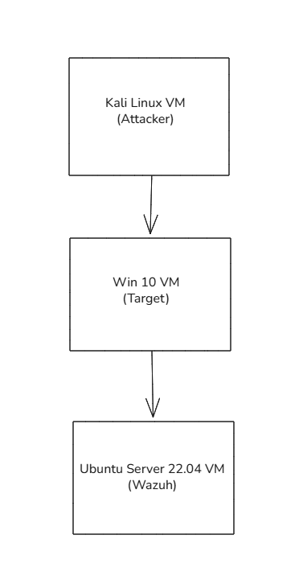
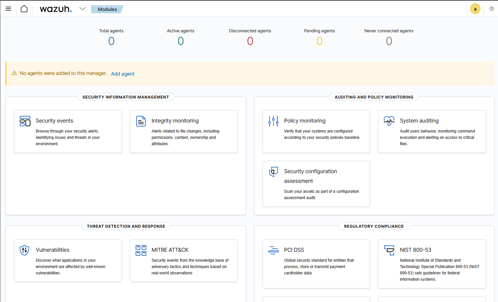
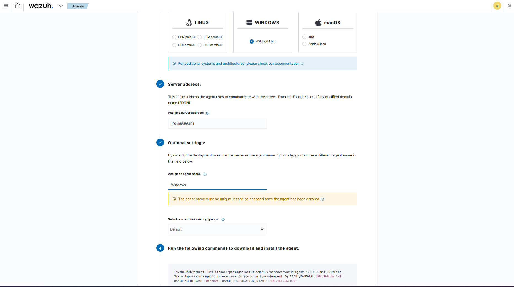
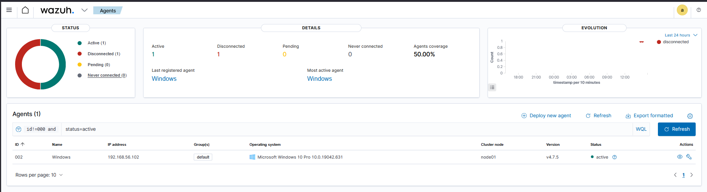
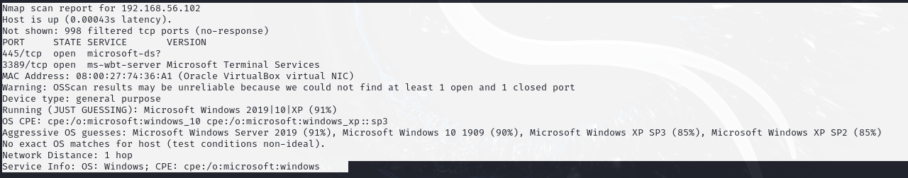
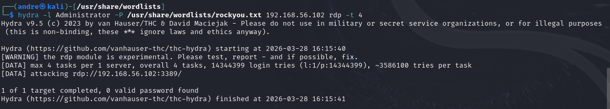
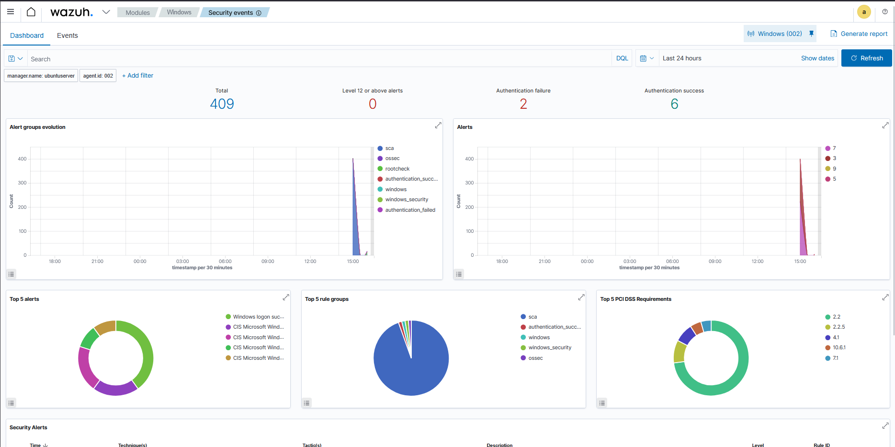
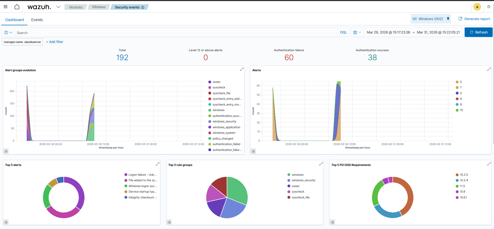
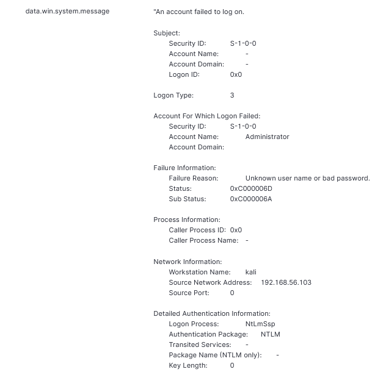
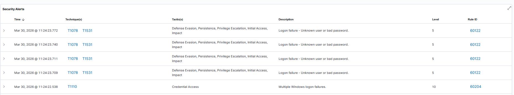

# SOC-in-a-Box Home Lab

## Overview

SOC-in-a-Box is a home lab project designed to simulate a Security Operations Center (SOC) environment using open-source security tools. The lab consists of a Wazuh SIEM server, a Windows endpoint, and a Kali Linux attacker machine operating within an isolated virtual network.

The goal of the project was to build an end-to-end monitoring environment capable of collecting logs, detecting malicious activity, generating alerts, and supporting incident response workflows.

## Technologies Used

* Wazuh SIEM
* Ubuntu Server 22.04
* Windows 10
* Kali Linux
* VirtualBox
* Hydra
* Nmap
* MITRE ATT&CK

## Architecture

### Components

| System        | Purpose                    |
| - | -- |
| Ubuntu Server | Wazuh SIEM Platform        |
| Windows 10    | Monitored Endpoint         |
| Kali Linux    | Attack Simulation Platform |

## Project Objectives

* Deploy a functional SIEM environment
* Configure endpoint log collection
* Simulate attacker activity
* Detect malicious behavior
* Investigate generated alerts
* Produce security documentation

## Environment Deployment

### Wazuh Installation

The Wazuh all-in-one platform was deployed on Ubuntu Server and verified through the web dashboard.

### Windows Agent Deployment

A Wazuh agent was installed on the Windows endpoint to forward security telemetry to the SIEM.

### Agent Verification

The Windows endpoint successfully connected to the Wazuh server and began transmitting events.

## Attack Simulation

### Reconnaissance

Nmap was used to identify exposed services on the target system prior to attack execution.

### Brute Force Attack

Hydra was used from the Kali Linux system to perform a password-guessing attack against the Windows Administrator account.

## Detection and Monitoring

### Dashboard Activity

The Wazuh dashboard reflected increased event activity generated during the attack simulation.

### Security Event Collection

Authentication events and related telemetry were successfully ingested by the SIEM platform.

### Event Investigation

Detailed event records provided visibility into attacker activity and authentication failures.

### Alert Generation and MITRE Mapping

Wazuh generated security alerts and associated the observed behavior with MITRE ATT&CK techniques.

## Documentation

Additional project documentation is available in the `/docs` directory.

* Implementation Guide
* Incident Report

